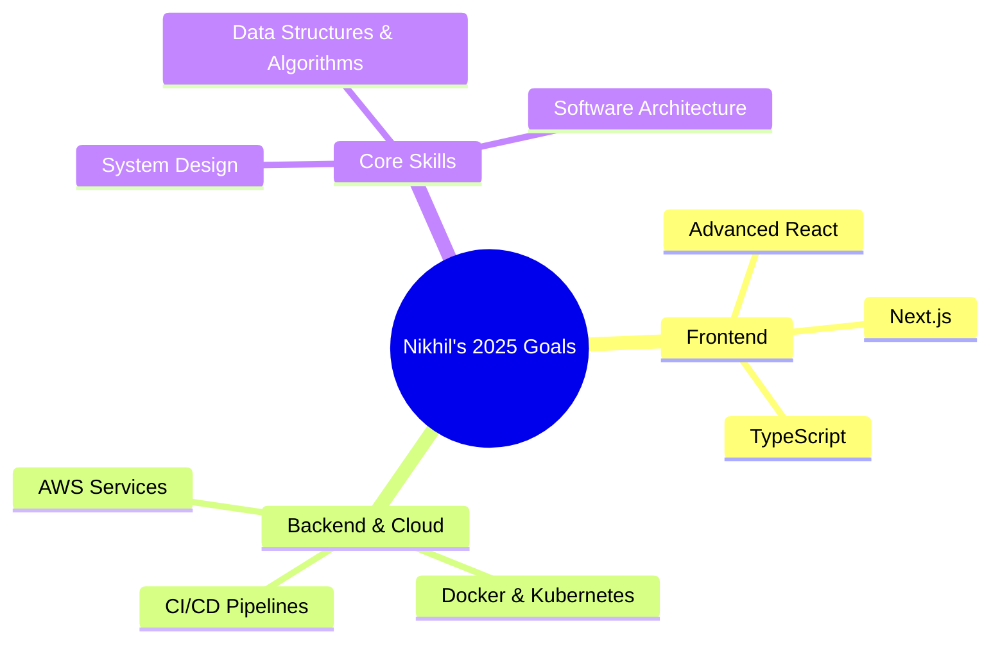

<div align="center">

<!-- Animated Banner -->


<!-- Typing Animation -->
<a href="https://git.io/typing-svg">
  
</a>

<br/>

<!-- Profile Views & Social Badges -->
<p>
  
  &nbsp;
  
</p>

</div>

---

## 🧑‍💻 About Me

```yaml
name       : Nikhil Mali
location   : Maharashtra, India
education  : MCA (pursuing) | BCA (graduate)
role       : Full Stack Developer
focus      : Scalable Web Apps · AI/ML Projects · Cloud & DevOps
available  : Open to Software Developer / Full Stack / Web Developer roles
fun_fact   : "JavaScript's == and === have caused more bugs than any other operator 😄"
```

- 🔭 Currently building full stack apps using **React, Node.js, Django & MySQL**
- 🌱 Actively learning **AWS, Docker, CI/CD & System Design**
- 🚀 Built **AI-powered projects** — Smart Stock Predictions & Travel Recommendation System
- 📊 Strong in **DSA, REST APIs, Database Design & Software Architecture**
- 💬 Ask me about **React, Python, Node.js, or anything Full Stack!**

---

## 🔗 Let's Connect

<div align="center">

[](https://www.linkedin.com/in/nikhil-mali-4038212ab)
[](https://nikhil-portfolio-bay.vercel.app/)
[](mailto:nikhilmali27103@gmail.com)
[](https://github.com/nikhilkeshavmali)
[](https://www.instagram.com/nikhil_mali_37/)

</div>

---

## 🛠️ Tech Stack

### 💻 Languages


### 🎨 Frontend


### ⚙️ Backend


### 🗄️ Databases


### ☁️ Cloud & DevOps


### 🧰 Tools & IDEs


---

## 🚀 Featured Projects

<div align="center">

| 🏗️ Project | 📝 Description | 🛠️ Tech Stack |
|:---|:---|:---|
| **📈 Smart Stock Predictions** | AI-powered analytics platform forecasting stock market trends using ML & data visualization | Python · ML · React · REST API |
| **🌍 Travel Recommendation System** | Intelligent platform analyzing data from multiple travel sites for personalized recommendations | Django · Python · Web Scraping · ML |
| **🏍️ Two Wheeler Sale System** | Desktop app for vehicle inventory & sales management with intuitive GUI | Python · Tkinter · MySQL |

</div>

> 💡 **More projects on [GitHub](https://github.com/nikhilkeshavmali) & [Portfolio](https://nikhil-portfolio-bay.vercel.app/)**

---

## 📊 GitHub Statistics

<div align="center">


&nbsp;


<br/>


<br/><br/>


</div>

---

## 🎯 Currently Learning

<div align="center">



</div>

---

## 🏆 Coding Profiles

<div align="center">

[](https://leetcode.com/)
[](https://www.hackerrank.com/)
[](https://www.codechef.com/)
[](https://www.geeksforgeeks.org/)

</div>

---

## 💼 What I Bring to the Table

```
✅ Full Stack development from DB design to deployment
✅ Experience with AI/ML-powered web applications
✅ REST API design, integration & testing
✅ Version control & collaborative development (Git, GitHub, GitLab)
✅ Agile mindset with tools like Jira
✅ Fast learner — always upskilling with cloud & modern dev tools
✅ Strong fundamentals: DSA, OOP, DBMS, OS, CN
```

---

<div align="center">

### 📬 Open to Opportunities — Let's Build Something Amazing!

[](mailto:nikhilmali27103@gmail.com)
[](https://nikhil-portfolio-bay.vercel.app/)

<br/>


</div>
