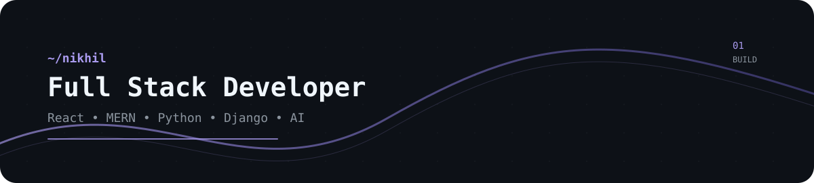
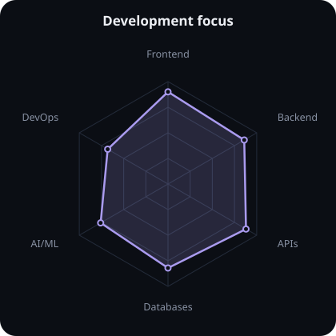
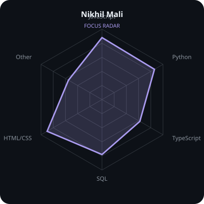
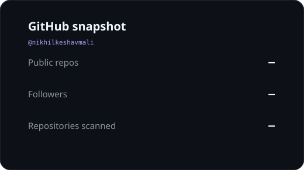
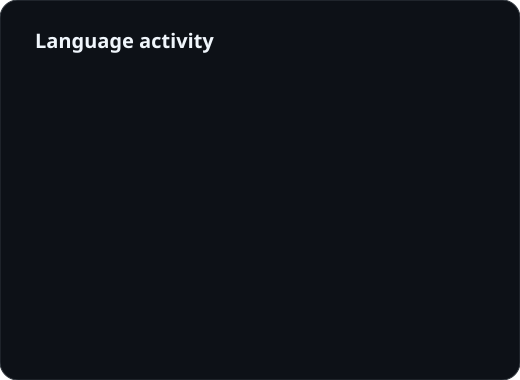

<div align="center">

<picture>
  <source media="(prefers-color-scheme: dark)" srcset="assets/banner-dark.svg">
  <source media="(prefers-color-scheme: light)" srcset="assets/banner-light.svg">
  
</picture>

<br>

<a href="https://github.com/nikhilkeshavmali">
  
</a>

<br><br>

<a href="https://linkedin.com/in/nikhilkeshavmali"></a>
&nbsp;&nbsp;
<a href="https://nikhilkeshavmali.vercel.app/"></a>
&nbsp;&nbsp;
<a href="https://github.com/nikhilkeshavmali"></a>

<br><br>


</div>

---

## 👋 This is me

Hi, I'm **Nikhil Mali**, a Full Stack Developer focused on building modern, practical web applications with **React, MERN, Python and Django**.

I enjoy working across the stack — from responsive interfaces and REST APIs to databases, authentication, deployment and AI-powered features.

- 💻 Full Stack Web Development
- ⚛️ React.js and modern JavaScript
- 🐍 Python, Django and Django REST Framework
- 🚀 MERN Stack
- 🤖 AI-powered applications and automation
- 🗄️ MongoDB, PostgreSQL and MySQL
- 🔐 JWT authentication and REST APIs
- 🛠️ Git, GitHub, Postman and Docker
- 🎓 MCA student focused on software engineering

<div align="center">

## 🧰 My stack


</div>

---

<div align="center">

## 📡 Signals

<table>
<tr>
<td width="50%" align="center" valign="middle">
<strong>Development Focus</strong><br><br>
<picture>
  <source media="(prefers-color-scheme: dark)" srcset="assets/radar-dark.svg">
  <source media="(prefers-color-scheme: light)" srcset="assets/radar-light.svg">
  
</picture>
</td>
<td width="50%" align="center" valign="middle">
<strong>Language Focus</strong><br><br>
<picture>
  <source media="(prefers-color-scheme: dark)" srcset="assets/radar-langs-dark.svg">
  <source media="(prefers-color-scheme: light)" srcset="assets/radar-langs-light.svg">
  
</picture>
</td>
</tr>
</table>

</div>

---

<div align="center">

## 📊 GitHub numbers

<picture>
  <source media="(prefers-color-scheme: dark)" srcset="assets/card-stats-dark.svg">
  <source media="(prefers-color-scheme: light)" srcset="assets/card-stats-light.svg">
  
</picture>

<br><br>


</div>

---

## 🚀 Featured projects

### 📈 Smart Stock Prediction System

**React + Django + MySQL + Python + Machine Learning**

A stock prediction platform for NSE stocks with authentication, multiple prediction horizons and a React dashboard.

- React frontend
- Django REST API
- Python regression model
- MySQL database
- JWT access/refresh authentication
- NSE stock data
- Prediction horizons from 1 week to 5 years

🔗 [Repository](https://github.com/nikhilkeshavmali/Smart-Stock-Price-Prediction-System)

---

### 📰 News E-Paper Platform

**MERN + PDF Processing + OCR + AI**

A newspaper/e-paper platform designed around PDF upload, news extraction, AI-assisted article generation, editorial review and publication.

- PDF upload and processing
- OCR pipeline
- AI-assisted news extraction
- News editing and review
- Categories and authentication
- E-paper/public article experience
- React frontend + Node/Express backend

🔗 [Repository](https://github.com/nikhilkeshavmali/news-e-paper-platform)

---

### 📱 Student Attendance Application

**React Native + Django REST + PostgreSQL**

A role-based attendance application for students, faculty and administrators.

- Student/faculty/admin roles
- REST API architecture
- Attendance management
- Admin reporting
- CSV/Excel workflows
- Mobile-first React Native experience

---

## 🧠 Currently learning

```text
Advanced React
     ↓
MERN architecture
     ↓
Python + Django REST
     ↓
AI integrations
     ↓
OCR + document processing
     ↓
Production deployment
```

---

## 🛠️ How I like to build

```text
Understand the problem
        ↓
Design the API / data flow
        ↓
Build the UI
        ↓
Connect backend + database
        ↓
Test
        ↓
Integrate carefully
        ↓
Deploy
        ↓
Improve
```

I prefer **small, understandable changes**, clean integration and software that can actually be maintained after the first release.

---

## 🤝 Let's connect

If you're working on **web development, React, Python, Django, MERN, AI-powered applications or developer projects**, feel free to connect.

<div align="center">
<a href="https://linkedin.com/in/nikhilkeshavmali"></a>
&nbsp;
<a href="https://nikhilkeshavmali.vercel.app/"></a>
<br><br>
<sub>⚡ Build. Learn. Ship. Repeat.</sub>
</div>
